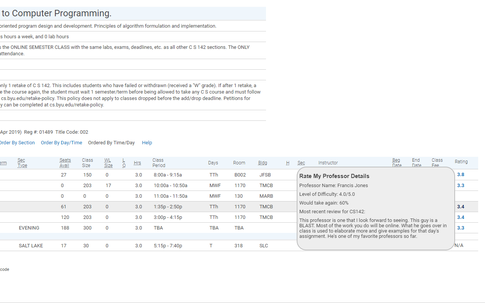

# Rate-My-Professor-Extension

This Google Chrome extension displays information about BYU professor ratings when students navigate to the BYU registration page. The extension queries the Rate My Professor API to request information about each professor's overall rating and difficulty rating, as well as other review info (seen in the image below). 

Once the API request is returned, a rating is added for each professor on the page, and each rating links to the related professor's rating page on ratemyprofessor.com.  When the user places their mouse over the rating, a tooltip is generated that shows more information, allowing the user to see most of the relevant  details they need without going to a seperate page.

Information is retrieved based on the professor's name.  No information will be shown if the professor's name is misspelled or absent from the Rate My Professor database.

The Tooltipster JQuery Plugin is used to generate the tooltips.

<a href="https://chrome.google.com/webstore/detail/rate-my-byu-professors/ghokpcnkghnkfofadiajmmhinooijmaf">Here</a> is the listing on the Chrome Web Store.

