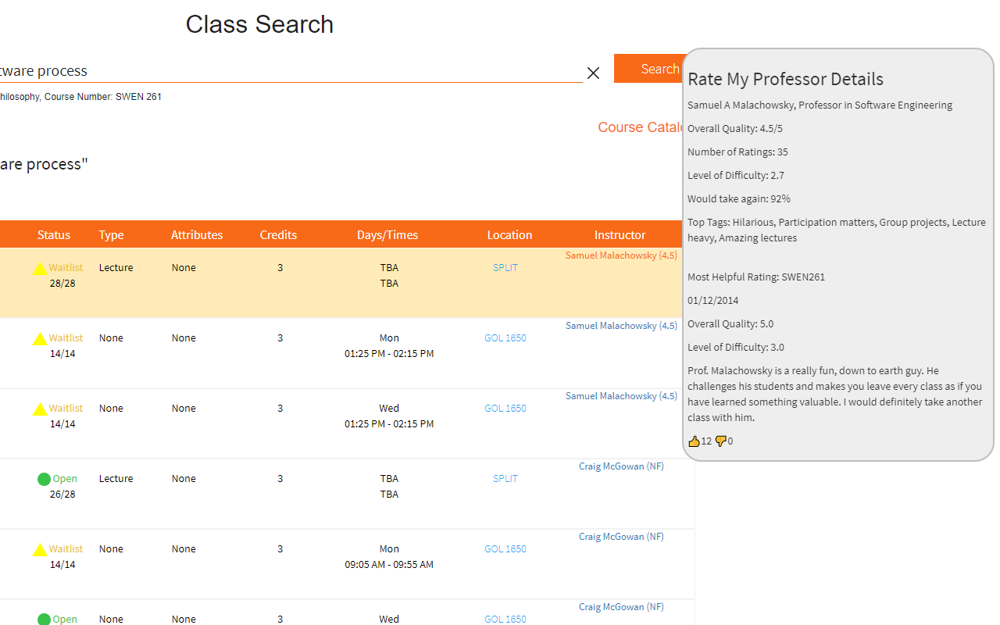

# Rate-My-Professor-Extension

This Google Chrome extension shows the [Rate My Professors](https://www.ratemyprofessors.com/) rating of professors while searching classes on [Tiger Center](https://tigercenter.rit.edu/tigerCenterApp/api/class-search).

Professors' names will now link to their Rate My Professors page (or the search results if not found) instead of to their email. The most helpful rating is chosen most recent rating with the most net upvotes (regardless of the quality given). (The most helpful rating on Rate My Professors always has a 5.0 in overall quality.) To better find professors, this extension will try all associated nicknames or diminutive names for first names from [here](https://github.com/carltonnorthern/nickname-and-diminutive-names-lookup). For example, Thomas Reichlmayr on Tiger Center is found as Tom Reichlmayr on Rate My Professors.

Todo:
- Make extension college-agnostic

Maybe:
- Add CSS to tooltip
